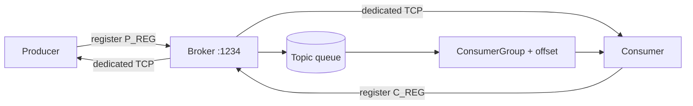

# MessageQueue_java

A small Kafka-inspired message queue in Java: a broker, producers, and consumers talk over TCP with topics and consumer groups.

## How it works

1. Start the **broker** (listens on `127.0.0.1:1234`).
2. Start a **producer** / **consumer** — each opens a local server socket, then registers with the broker.
3. The broker dials back and keeps a **dedicated channel** for that client.
4. Producers push messages into a topic queue; consumer groups pull and advance offsets independently.



## Requirements

- JDK 17+ (or whatever your local toolchain uses)
- Gradle Wrapper (`./gradlew`)

## Run

Start the broker first, then producer/consumer in separate terminals.

```bash
# Broker
./gradlew run --args="broker"

# Producer: <port> <topicId>
./gradlew run --args="producer 9936 1"

# Consumer: <port> <topicId> <groupId>
./gradlew run --args="consumer 9836 1 0"
```

Producer reads message lines from stdin and sends them on the dedicated channel.

## Project layout

```
src/main/java/mq/
  Application.java      # entry: broker | producer | consumer
  Broker.java           # registration + dedicated channels
  Producer.java / Consumer.java
  Topic.java / Queue.java / ConsumerGroup.java
  Message.java / MessageType.java
  common/               # Constants, helpers
  protocol/             # register request codecs
```

## Design notes

**Dedicated channels.** Registration is a short request/response on the broker port. After that, the broker connects to the client’s port and keeps one long-lived TCP stream per producer/consumer. That avoids opening a new connection (handshake + TIME_WAIT) for every message.

**Locks.** Each `Topic` has a `ReentrantLock` around the shared message queue and consumer-group list. Each `ConsumerGroup` locks offset updates during pop so concurrent consumers in the same group don’t race.

## Limits

| Setting        | Value            |
|----------------|------------------|
| Broker address | `127.0.0.1:1234` |
| Max message    | 255 bytes        |
| Queue capacity | 10_000           |
