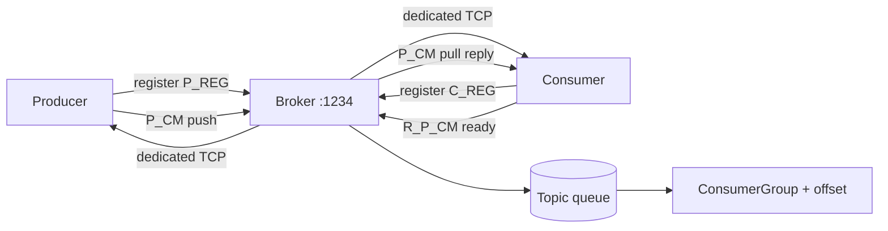

# MessageQueue_java

A small Kafka-inspired message queue in Java: a broker, producers, and consumers talk over TCP with topics and consumer groups.

## How it works

1. Start the **broker** (listens on `127.0.0.1:1234`).
2. Start a **producer** / **consumer** — each opens a local server socket, then registers with the broker.
3. The broker dials back and keeps a **dedicated channel** for that client.
4. Producers **push** `P_CM` into a topic queue.
5. Consumers **pull**: they send `R_P_CM` (ready) first; the broker then peeks the group offset and replies with `P_CM`. Each consumer group keeps its own offset.


```mermaid
flowchart LR
  P[Producer] -->|register P_REG| B[Broker :1234]
  C[Consumer] -->|register C_REG| B
  B -->|dedicated TCP| P
  B -->|dedicated TCP| C
  P -->|P_CM push| B
  C -->|R_P_CM ready| B
  B -->|P_CM pull reply| C
  B --> T[(Topic queue)]
  T --> G[ConsumerGroup + offset]
```

## Requirements

- JDK 17+ (or whatever your local toolchain uses)
- Gradle Wrapper (`./gradlew`)

## Run

Start the broker first, then producer/consumer in separate terminals.

```bash
# Broker
./gradlew run --args="broker"

# Producer: <port> <topicId>
./gradlew run --args="producer 9936 1"

# Consumer: <port> <topicId> <groupId>
./gradlew run --args="consumer 9836 1 0"
```

The default producer entry (`startAndSimulateProducerServer`) sends a timestamped line every second. `Producer.startProducerServer()` still reads lines from stdin if you switch `Application` back to that method.

The consumer sends ready, waits for `P_CM`, then sleeps 5 seconds to simulate processing before the next ready.

## Project layout

```
src/main/java/mq/
  Application.java      # entry: broker | producer | consumer
  Broker.java           # registration + dedicated channels + pull delivery
  Producer.java / Consumer.java
  Topic.java / Queue.java / ConsumerGroup.java
  Message.java / MessageType.java
  common/               # Constants, helpers
  protocol/             # register request codecs
```

## Design notes

**Dedicated channels.** Registration is a short request/response on the broker port. After that, the broker connects to the client’s port and keeps one long-lived TCP stream per producer/consumer. That avoids opening a new connection (handshake + TIME_WAIT) for every message.

**Pull-based consumption.** After a consumer registers, the broker starts one `readConsumerReadyAndSend` thread for that connection (not one loop per group). The thread blocks on `R_P_CM`. When ready arrives, it locks the group, `peekAt(offset)`, sends `P_CM`, and increments the shared group offset. If the queue has nothing at that offset, it polls instead of waiting for another ready (the consumer is already blocked on the next `P_CM`). Consumers in the same group compete for the next offset; different groups each have their own offset.

**Locks.** Each `Topic` has a `ReentrantLock` around the consumer-group list. Each `ConsumerGroup` lock serializes peek / send / offset advance so concurrent consumers in the same group do not get the same message. A per-topic `stopAndPop` thread (every 50s) drops messages already consumed by every group and shifts offsets down.

## Limits

| Setting        | Value            |
|----------------|------------------|
| Broker address | `127.0.0.1:1234` |
| Max message    | 255 bytes        |
| Queue capacity | 10_000           |
