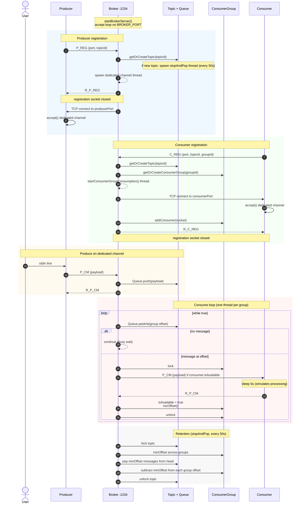

# Current system sequence

Wire format on every TCP stream: `[length][type][data]`. Registration uses a short connection to the broker on `127.0.0.1:1234`. After that, the broker dials the client’s listen port and keeps one dedicated TCP stream.

## Message types used

| Type | Direction | When |
|------|-----------|------|
| `P_REG` / `R_P_REG` | Producer ↔ Broker (broker port) | Register producer listen port and topic |
| `C_REG` / `R_C_REG` | Consumer ↔ Broker (broker port) | Register consumer listen port, topic, group |
| `P_CM` / `R_P_CM` | Producer → Broker (dedicated) | Push payload into the topic queue |
| `P_CM` / `R_P_CM` | Broker → Consumer (dedicated) | Deliver peeked message; ack before offset advances |

## Threads on the broker

- Accept loop on `:1234` (registration only).
- One dedicated-channel thread per producer (read `P_CM`, push, ack).
- One consumption thread per consumer group (peek, send, wait for ack, increment offset).
- One `stopAndPop` thread per topic (trim messages already consumed by every group).
